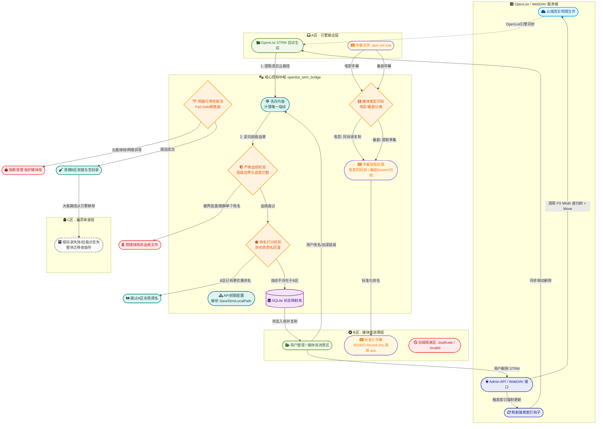

# OpenList STRM Bridge

`openlist_strm_bridge` 是专为 **OpenList STRM 引擎更新模式** 量身打造的**智能防灾同步中间件**。

它的核心职责是：作为 OpenList 与媒体库（Emby / Jellyfin）之间的协调中枢，打通 STRM 的"**生成 -> 刮削消费 -> 重命名整理 -> 删除 -> 云端联动 -> 冗余回收**"整条闭环链路，并**智能处理字幕文件同步**。在此过程中，提供极强的自我保护能力，防止手误或网络异常导致的数据灾难。

---

## 🌟 核心特性

1. **API 动态映射（告别死板配置）**
   启动时主动调用 OpenList Admin API 抓取所有 `driver=strm` 的存储节点，自动梳理本地路径与云端真实监控路径的分组映射，实现真正的云端配置对齐。

2. **智能媒体类型识别与字幕同步**
   自动识别电影/番剧类型，电影字幕保持同目录结构，番剧字幕按 `Season XX/S01E01.forced.zho.简体.ass` 标准格式归档，与 STRM 文件协同同步到 B 区。

3. **严防死守的血统鉴权（防越界/防脱群）**
   任何试图进入媒体库的文件必须接受溯源校验。严禁将番剧提取至引擎根目录，严禁跨库移动。对于单集的脱群改名，引入 **30 秒观察期**，一旦确认是非法越界操作，直接物理击杀，防止云端被误删。

4. **优胜劣汰的单实例去重（防重复刮削）**
   同一个视频源只允许一个可见实例。内置打分器（标准刮削命名 `S01E01` 绝对优先 > 路径越短越好）。劣质命名会被自动重命名为 `.duplicate` 进行物理隔离，确保媒体库不仅无重复，且展示的永远是最优命名。

5. **B 区逆向自同步（启动自愈）**
   启动时先对 B 区进行全量底细盘点：物理磁盘 vs 数据库记录双向比对。发现离线拷入的新 STRM 直接入库；发现失效路径自动清理；发现改名文件自动追踪。确保数据库是物理磁盘的"真实投影"。

6. **云端回收站智能重建**
   触发删除联动时，程序会截取云端真实目录结构，通过连续调用 API，在配置的回收站内**一比一重建原文件夹树**再执行移动，为后续的完美恢复提供退路。

7. **被破坏文件自动恢复**
   如果媒体库中的 STRM 文件内容被意外清空或损坏，程序会逆向查库，并从源头自动将其恢复。

---

## 🗺️ 系统工作流与架构图



---

## 📂 目录模型说明 (A / B / C 三分区)

- **A 区 (生肉区)**：OpenList 引擎更新模式的输出目录。程序在此区提取 WebDAV 映射和建立身份指纹。同时监控同目录下的字幕文件（`.ass`、`.srt`、`.ssa`）。
- **B 区 (熟肉区)**：Emby / Jellyfin真正扫描的目录。用户在此区自由改名、整理、删除。程序将用户的操作翻译为云端 API 指令。字幕文件按媒体类型智能归档：电影字幕保持同目录，番剧字幕进入 `Season XX/` 子目录。
- **C 区 (幽灵区)**：用于收容因为云盘根目录大改版、挂载点删除而导致的失效路径。保留历史痕迹，不污染媒体库，也避免直接蒸发导致找不回原文件。

---

## 🎬 字幕处理说明

程序自动识别并同步 A 区的字幕文件到 B 区，支持智能媒体类型判断：

| 媒体类型 | 检测方式 | 字幕目标路径 | 命名示例 |
| :--- | :--- | :--- | :--- |
| **电影** | 路径含"电影/movie"等关键词，或目录下仅1个STRM且无季集信息 | 与对应STRM同目录 | `电影名.forced.zho.简体.ass` |
| **番剧** | 路径含"番剧/anime"等关键词，或STRM/文件名可提取季集 | `Season XX/` 子目录 | `S01E01.forced.zho.简体.ass` |

- 字幕语言自动识别：支持 `.sc`、`.chs`、`.tc`、`.cht` 等后缀标识，以及"简中""繁体"等关键词
- 多语种时简中优先标记 `forced`
- 使用数据库 `subtitles` 表追踪处理状态，避免重复处理

---

## ⚙️ 配置文件

主要配置文件包括：

- `config.toml` (主配置文件)
- `a_folders.txt` (A区本地监听路径)
- `refresh_paths.txt` (云端主动刷新与探活路径)
- `strm_engine_paths.txt` (STRM引擎入口路径)

### 配置说明

具体配置项及参数请参考项目内的注释文档。

---

## 🚀 部署与运行

### 1. 安装依赖

```bash
pip install -r requirements.txt
```

所需主要依赖：

- `watchdog` (文件系统监控)
- `requests` (API 请求交互)
- `lxml` (WebDAV XML解析)
- `tomli` (Python < 3.11 环境下需要)

### 2. 运行程序

**标准 Python 环境：**

```bash
python main.py
```

**Windows 建议使用启动脚本 (BAT)：**
项目推荐使用便携式嵌入版 Python，可以直接编写 `run.bat` 一键启动：

```bat
@echo off
setlocal
cd /d "%~dp0"

set "PYTHON=%~dp0python_embed\python.exe"
set "APP=%~dp0main.py"

echo =======================================================
echo   OpenList STRM Bridge - 守护进程启动
echo =======================================================
"%PYTHON%" "%APP%"
pause
```

---

## 📝 日志分级说明

默认日志文件输出至 `activity.log`，内置按大小截断轮转机制。

| 级别 | 用途 |
| :--- | :--- |
| `INFO` | 记录启动、API 握手成功、文件联动删除、清理等重要里程碑。 |
| `DEBUG` | 用于排查指纹计算、血统拦截细节、重命名追踪溯源、字幕处理等。 |
| `WARNING` | 可恢复的异常，如单兵脱群观察期、劣质文件隔离、字幕降级处理等。 |
| `ERROR` | API 联动失败、数据库写入失败等严重操作异常。 |

> **建议：** 大媒体库正常服役时使用 `INFO` 级别即可保持日志清爽；排查同步问题时临时切换为 `DEBUG`。

---

## ⚠️ 使用建议与注意事项

1. **初期安全建议**：在 `config.toml` 中强烈建议使用 `action = "MOVE"` 而非 `DELETE`。先在云端回收站观察联动效果，确认无误后再视情况调整。
2. **字幕测试**：正式接入前，建议先用测试目录验证字幕同步：`电影字幕同目录保留`、`番剧字幕Season归档`、`多语种forced标记`。
3. **测试验证**：正式接入庞大媒体库前，建议先用测试目录验证：`A -> B 优选同步`、`B 跨级移动血统拦截`、`B 删除联动云端回收站`。
4. **数据库重建**：如果大规模修改了 OpenList 的存储结构，建议清空 `bridge.db` 让程序重新逆向建库。

---

## 🌿 分支规划

本项目计划与 OpenList 不同的 STRM 模式共用同一仓库，通过分支维护：

- `main`：稳定版本
- `sync_strm`：STRM 引擎更新模式 (本分支)

---

## 📄 License

本项目采用 [MIT License](LICENSE) 协议。
