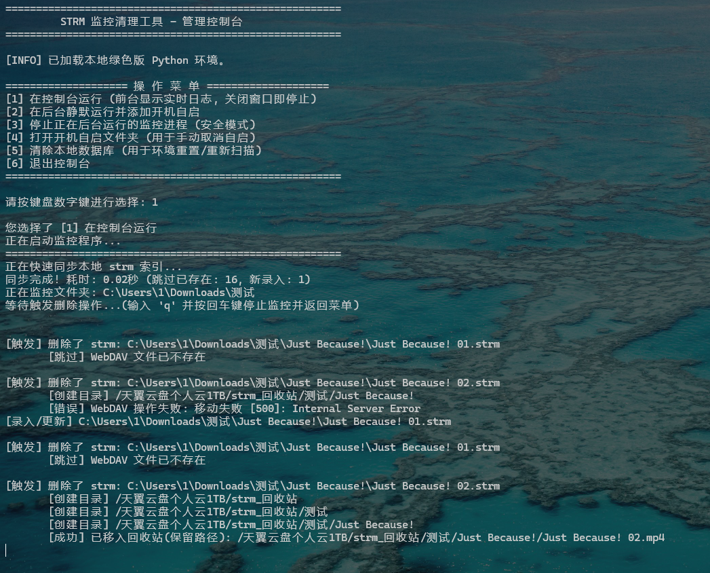

# openlist_strm_monitor

君只见生成strm的工具多样 却不见删除strm后对应源文件的狼狈

[](https://www.python.org/)
[](LICENSE)
[](https://www.microsoft.com/windows/)

---

## 📚 快速导航与分支说明

本项目采用多分支管理不同的部署场景，并配有极尽详尽的系统设计架构 Wiki。在部署前请务必阅读文档。

- **📖 官方 Wiki 知识库**：点击访问 [Wiki](/../../wiki) 获取最详细的架构设计、血统校验边界、网络探活断路器及注意事项。
- **🌿 STRM 引擎同步模式（推荐）**：请切换至 [sync_strm 分支](/../../tree/sync_strm)获取配合 OpenList 引擎同步模式的本地双向协调器源码。

---

### 📖 项目简介

在 Emby/Jellyfin 中，我们经常使用 `strm` 文件来挂载云盘资源，避免刮削的时候频繁读取修改云盘文件，既加快刮削的速度(不需要读取mediainfo)也免除了云盘的速率限制或风控。

openlist生成的strm是http url 而非其他工具的路径格式，故而神医助手或者类似的strm多功能插件处理不了此类的 `追删`，`深度删除`

程序实时监控 Windows 本地文件夹，当 `.strm` 文件被删除时，程序会通过本地数据库进行"二次校验"，精准定位 WebDAV 端的原始视频，并执行 **同步删除** 或 **移动至回收站** 的操作。

---

### ✨ 核心功能

*   🚀 **极速增量扫描**：采用 SQLite3 数据库索引技术，启动时秒级同步数千个 strm 文件。仅处理变动部分，不产生冗余磁盘 IO。
*   实时监控：基于 `watchdog` 内核级事件监听，毫秒级响应本地文件变动（新增、修改、删除）。
*   二次校验机制：在本地数据库持久化存储 `Local <-> WebDAV` 映射。即便 `.strm` 文件已被物理删除，程序依然能通过数据库找回其原始 WebDAV 路径，确保删除动作精准下发。
*   智能回收站 (MOVE)：支持**保留原始层级**的移动操作，而非简单的暴力删除。
    *   *示例：* 云端文件 `/电影/A/1.mp4` 对应的本地索引被删除时，程序会将其安全移至 `/回收站/电影/A/1.mp4`。
*   Openlist WebDAV 深度适配：针对 Openlist 进行了专项协议优化，解决了 URL 编码歧义、403 鉴权过期及 500 内部服务错误等常见 WebDAV 兼容性问题。
*   **兼容批量重命名冗余清理**：WebDAV 挂载后使用批量重命名工具产生多次strm文件。
    *   *流程示例：* 
        1. 识别 `1.mp4` -> 生成 `1.strm`（第一次更新）。
        2. 重命名工具将 `1.mp4` 重命名为 `S01E01.mp4` -> 生成 `S01E01.strm`（第二次更新）。
        3. **程序自动识别**云端已无 `1.mp4`，瞬间抹除残留的冗余索引 `1.strm`。
        4. 此功能可以避免 `1.strm` 和 `S01E01.strm` 同时存在。
*   文件夹级联动：当嗅探到云端文件夹被重命名或彻底消失时，程序会触发"级联清理"，自动抹除本地对应目录下的所有失效索引及空文件夹。
*   **颜色控制台**：新增强项——控制台彩色实时日志，不同级别事件以不同颜色区分，一目了然。
*   **控制台心跳**：新增强项——每10秒 `[TIME]` 带颜色时间戳，方便判断程序存活和测试
*   轻量绿色部署：支持 Python 嵌入式版本运行，无需安装全局 Python 环境，不污染系统，解压即用。

---

### 📂 项目结构

```text
.
├── python_embed/                        # Python 嵌入式绿色环境目录
│   └── strm_mapping.db                  # 自动生成的本地路径映射数据库 (SQLite)
├── strm_monitor.py                      # 核心监控 Python 程序
├── config.ini                           # 配置文件 (存储路径、账号及模式)
└── openlist_strm_monitor_debug.bat      # 一键管理控制台 (启动/停止/自启/清理)
```
<p align="center">
  
</p>

---

### 🛠️ 工作原理

1.  **索引构建**：启动时扫描 `MonitorFolders`，将 strm 内容及其对应的云端路径存入 `data.db`。
2.  **事件驱动**：
    *   **Create/Modify**: 解析 strm 内容，更新数据库映射。
    *   **Delete**: 触发钩子，根据数据库记录的路径，通过 WebDAV 执行删除或移动到回收站。
    *   **二次清理**: 用户手动删除本地 `.strm` 后，程序会联动删除云端源文件。但 OpenList 感知到云端变动后，会触发更新钩子**重新生成**该 `.strm`，形成"删了又生"的循环。二次清理机制通过 **60 秒 ghost 保护期**解决此问题：
    *   用户删除 `.strm` 时，程序写入一条 ghost 记录（保护期 60 秒）
    *   若保护期内 OpenList 又生成了同名 `.strm`，程序自动识别并再次删除
    *   保护期结束后，若用户确实需要，再次添加的 `.strm` 将正常保留

3.  **自愈体检**：
    *   通过 `RefreshPaths` 定期轮询云端状态。
    *   若云端文件因手动操作删除，程序会清理本地对应的 `.strm` 以防止 Emby/Jellyfin 播放报错。

---

### 🚀 快速开始

#### 1. 环境准备
*   **推荐方式**：下载本项目源码后，将官方 [Python Windows embeddable](https://www.python.org/downloads/windows/) 版本解压到 `python_embed` 文件夹。
*   **手动安装依赖**：
    ```bash
    .\python_embed\Scripts\pip.exe install watchdog requests
    ```
*  顺带一提 pip也是要[get-pip.py](./python_embed/get-pip.py)手动装的
    ```bash
    .\python_embed\python.exe get-pip.py
    ```
*  或者 直接使用[Releases](../../releases/latest/download/openlist_strm_monitor_python_embed_amd64_win.zip)版本
#### 2. 填写配置
在项目根目录创建 `config.ini`，参考以下内容：

```ini
[Local]
; SQLite 数据库文件路径 (建议放在 python_embed 目录下)
db_file = ./python_embed/strm_mapping.db

[MonitorFolders]
; 本地监控strm路径，每行一个，不需要逗号、不需要序号、不需要空格
C:\box\strm.local
C:\box\strm

[WebDAV]
; Openlist WebDAV 根路径
host = http://192.168.1.1:5243/dav
user = admin
password = 1

[RefreshPaths]
; 需要主动刷新的云盘路径,每行一个(留空表示不刷新),首次启动会较久
; 此处即 openlist strm驱动中填写的路径 
; 因为目的就是触发更新钩子生成strm 还需要配置webdav_refresh_interval刷新间隔
; 警告：不建议为挂载了【本地机械硬盘】的路径开启此功能，会导致硬盘频繁唤醒和磁头损耗！
/天翼云盘家庭云1TB/番剧
/天翼云盘家庭云30GB/番剧
/天翼云盘个人云1TB/番剧
/天翼云盘个人云30GB/番剧
/天翼云盘家庭云1TB/电影
/天翼云盘家庭云30GB/电影
/天翼云盘个人云1TB/电影
/天翼云盘个人云30GB/电影

[Setting]
; 操作模式: MOVE 或 DELETE 
; 作为测试,务必先使用MOVE,或使用没有删除权限的账号
action = MOVE
; 各个路径下独立的回收站文件夹名称
trash_dir_name = strm_回收站
; 主动刷新WebDAV挂载路径的间隔(分钟)。设置为 0 则关闭此功能。
; 警告：不建议为挂载了【本地机械硬盘】的路径开启此功能，会导致硬盘频繁唤醒和磁头损耗！
webdav_refresh_interval = 60
; 刷新深度：1 表示只扫根目录，2 表示扫两层，以此类推。
; 建议设为 4，足以覆盖“/挂载盘/番剧/异兽魔都/season 01/S01E01.mp4”这种结构。
webdav_refresh_depth = 4

[Log]
; 日志级别: DEBUG (记录所有细节) 或 INFO (只记录核心操作)
level = DEBUG
; 日志文件的存放路径
file = ./activity.log
; 限制日志文件最大为 2MB，超过则重置
max_size_mb = 2
```

#### 3. 运行管理
双击运行 **`openlist_strm_monitor_debug.bat`**：
- [1] 在控制台运行 (前台显示实时日志, 关闭窗口即停止)
- [2] 在后台静默运行并添加开机自启
- [3] 停止正在后台运行的监控进程 (安全模式)
- [4] 打开开机自启文件夹 (用于手动取消自启)
- [5] 清除本地数据库 (用于环境重置/重新扫描)
- [6] 退出控制台

---

### ⚠️ 常见问题说明

*   **初次运行：** 程序会执行全量扫描，根据 strm 数量多少，耗时可能在数秒到数分钟不等。
*   **权限限制：** 请确保运行程序的账户对 `MonitorFolders` 有读取/删除权限，对工作目录有写入权限。
*   **安全警告：** `DELETE` 模式是破坏性的，建议先使用 `MOVE` 模式测试无误后再切换。

---

### 🤝 致谢

感谢[openlist](https://github.com/OpenListTeam/OpenList) 的支持

---

### 📄 开源协议

本项目采用 [MIT License](LICENSE) 协议。
```
