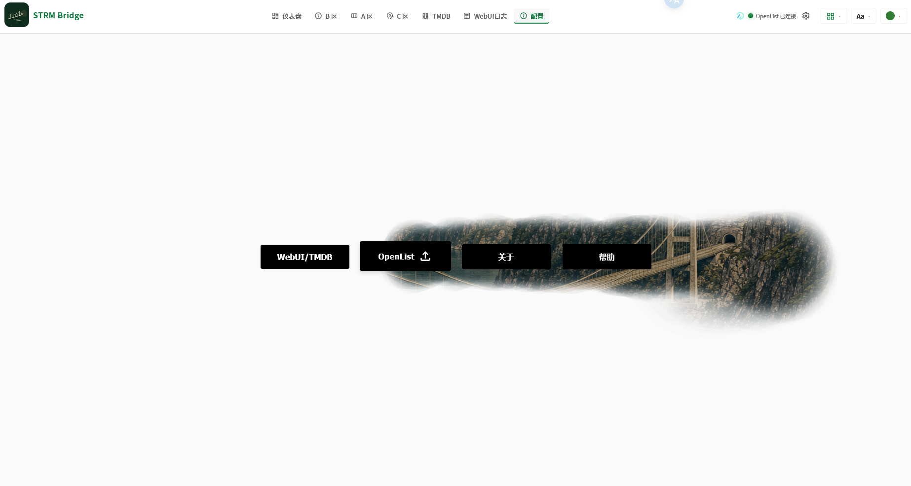
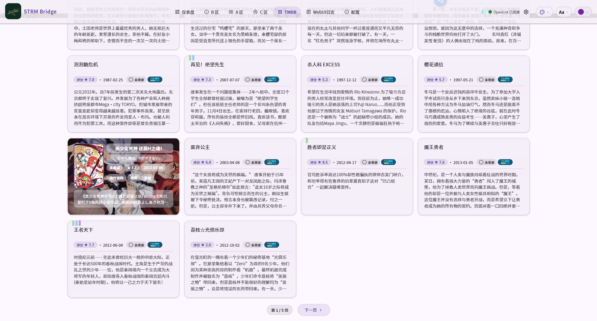
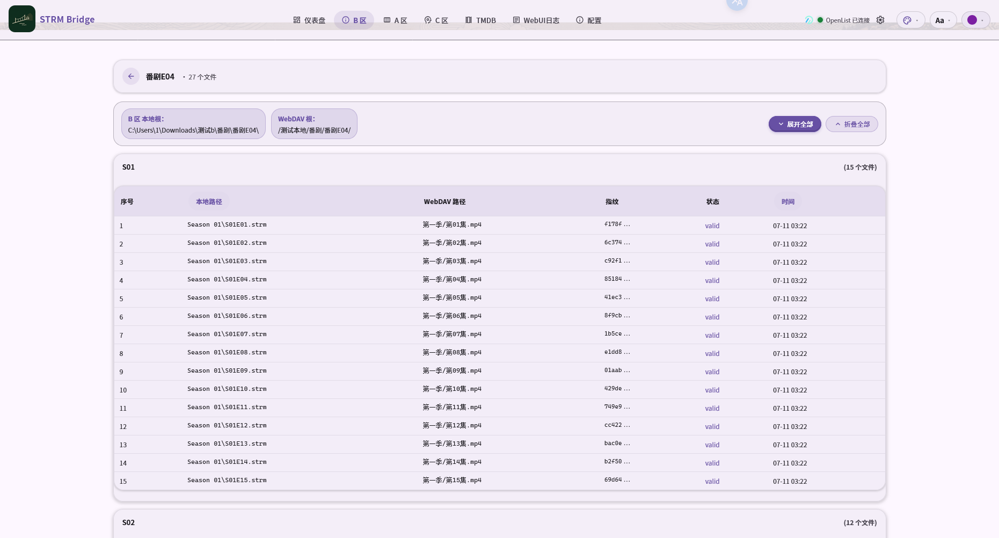
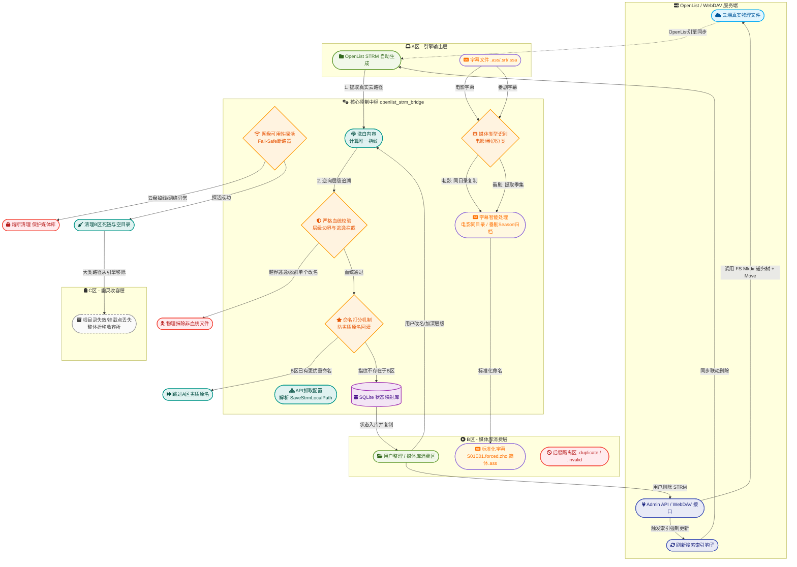

# OpenList STRM Bridge

`openlist_strm_bridge` 是专为 **OpenList STRM 引擎更新模式** 量身打造的**智能防灾同步中间件**。

它的核心职责是：作为 OpenList 与媒体库（Emby / Jellyfin）之间的协调中枢，打通 STRM 的"**生成 -> 刮削消费 -> 重命名整理 -> 删除 -> 云端联动 -> 冗余回收**"整条闭环链路，并**智能处理字幕文件同步**。在此过程中，提供极强的自我保护能力，防止手误或网络异常导致的数据灾难。

---

<p align="center">
  
</p>

---

<p align="center">
  
</p>

---

<p align="center">
  
</p>

---

## 🌟 核心特性

1. **API 动态映射（告别死板配置）**
   启动时主动调用 OpenList Admin API 抓取所有 `driver=strm` 的存储节点，自动梳理本地路径与云端真实监控路径的分组映射，实现真正的云端配置对齐。

2. **智能媒体类型识别与字幕同步**
   自动识别电影/番剧类型，电影字幕保持同目录结构，番剧字幕按 `Season XX/S01E01.forced.zho.简体.ass` 标准格式归档，与 STRM 文件协同同步到 B 区。

3. **严防死守的血统鉴权（防越界/防脱群）**
   任何试图进入媒体库的文件必须接受溯源校验。严禁将番剧提取至引擎根目录，严禁跨库移动。对于单集的脱群改名，引入 **30 秒观察期**，一旦确认是非法越界操作，直接物理击杀，防止云端被误删。

4. **优胜劣汰的单实例去重（防重复刮削）**
   同一个视频源只允许一个可见实例。内置打分器（标准刮削命名 `S01E01` 绝对优先 > 路径越短越好）。劣质命名会被自动重命名为 `.duplicate` 进行物理隔离，确保媒体库不仅无重复，且展示的永远是最优命名。

5. **B 区逆向自同步（启动自愈）**
   启动时先对 B 区进行全量底细盘点：物理磁盘 vs 数据库记录双向比对。发现离线拷入的新 STRM 直接入库；发现失效路径自动清理；发现改名文件自动追踪。确保数据库是物理磁盘的"真实投影"。

6. **云端回收站智能重建**
   触发删除联动时，程序会截取云端真实目录结构，通过连续调用 API，在配置的回收站内**一比一重建原文件夹树**再执行移动，为后续的完美恢复提供退路。

7. **被破坏文件自动恢复**
   如果媒体库中的 STRM 文件内容被意外清空或损坏，程序会逆向查库，并从源头自动将其恢复。

---

## ⚡ 性能优化

### 启动性能

当前版本对启动流程进行了重大优化：

**优化前**：
- 4000 条记录：~18 分钟
- 每个文件独立开关数据库连接（~15ms/次）
- 逐文件处理，无批量操作
- A 区冗余清理：5 万次 `check_exists` × 150ms = 2 小时

**优化后**：
- 50000 条记录：< 2 分钟
- 使用 `bulk_connection()` 长连接模式（1 个连接 + 1 次提交）
- 批量索引 + 预加载缓存
- A 区冗余清理：500 次 API 请求 × 100ms / 5 并发 = 10 秒
- **主动刷新路径**（`refresh_paths`）：留空时跳过周期性扫描，但 B 区删除联动仍正常工作
- **全量审计周期**（`full_audit_interval_days`）：每隔多少天执行一次 A→B 全量审计（默认周期执行，`0` 关闭）。周期配置来自 `tmdb_watchlist.db` 的 `webui_config` 表（scope=`openlist`，DB 键 `refresh_full_audit_interval_days`）；上次审计时间 `last_full_audit_at` 则来自 `bridge.db` 的 `sync_control` 表，两者是不同的持久化字段

**关键技术**：
- `initial_scan_a()` 批量索引 A 区 STRM 文件（多线程 4 线程并发读取，每 100 条或每 2 秒输出进度日志 + records/s 性能基准）
- `cleanup_a_redundant_using_api()` 使用 OpenList API 批量清理冗余（并发分页 + 客户端过滤）
- A 区冗余清理采用 **fail-closed** 策略：若某父目录的云端文件列表不可信（网络异常、响应畸形、分页不完整），该目录下的本地 A 记录整组不参与冗余差集，确保不会误删。
- `OpenListAdminClient.check_exists()` 采用 **三态** 语义（`True` / `False` / `None`）：不可信响应（`data=None`、`content=None`、bool `total`、非 0/200 code、安全阀耗尽）返回 `None` 而非 `False`。所有「不存在则删」的清理调用方仅当 `check_exists() is False`（权威不存在）才执行删除；`None` 视为不可信而跳过清理，避免假阴性误删。
- `ensure_single_visible_instance()` 在 quarantine 失败或 DB 迁移回滚成功后，把重复实例的 status 恢复为 `valid`（B3-A），避免「DB=duplicate / 磁盘仍为原 .strm」分叉导致 ensure 永不重试的死锁；DB 迁移回滚也失败时尝试把 DB local_path 对齐到 quarantined 路径（B3-B），再 raise 暴露极端态。
- `scan_a_to_b_full_sync()` 双模式同步（单事务 / 分批提交）
- 预加载 ghost 保护和 B 区指纹到内存缓存
- 跳过启动时的 per-file HTTP `check_exists` 和血统校验

---

## 🗺️ 系统工作流与架构图


```mermaid
flowchart TD
    %% ================= 核心样式定义 =================
    classDef cloudNode fill:#e1f5fe,stroke:#03a9f4,stroke-width:2px,color:#01579b,rx:8px,ry:8px;
    classDef apiNode fill:#e8eaf6,stroke:#3f51b5,stroke-width:2px,color:#1a237e,rx:8px,ry:8px;
    classDef coreNode fill:#e0f2f1,stroke:#009688,stroke-width:2px,color:#004d40,rx:8px,ry:8px;
    classDef decisionNode fill:#fff3e0,stroke:#ff9800,stroke-width:2px,color:#e65100;
    classDef dangerNode fill:#ffebee,stroke:#f44336,stroke-width:2px,color:#b71c1c,rx:8px,ry:8px;
    classDef dbNode fill:#f3e5f5,stroke:#9c27b0,stroke-width:2px,color:#4a148c;
    classDef areaNode fill:#f1f8e9,stroke:#689f38,stroke-width:2px,color:#33691e,rx:8px,ry:8px;
    classDef ghostNode fill:#fafafa,stroke:#9e9e9e,stroke-width:2px,color:#424242,stroke-dasharray: 5 5,rx:8px,ry:8px;
    classDef subtitleNode fill:#fff8e1, #ffc107,stroke-width:2px,color:#ff6f00,rx:8px,ry:8px;

    %% ================= 结构定义 =================
    subgraph Server [fa:fa-server OpenList / WebDAV 服务端]
        Cloud([fa:fa-cloud 云端真实物理文件]):::cloudNode
        API([fa:fa-plug Admin API / WebDAV 接口]):::apiNode
        Hook([fa:fa-sync 刷新搜索索引钩子]):::apiNode
    end

    subgraph AreaA [fa:fa-inbox A区 - 引擎输出层]
        A_DIR([fa:fa-folder OpenList STRM 自动生成]):::areaNode
        A_SUB([fa:fa-closed-captioning 字幕文件 .ass/.srt/.ssa]):::subtitleNode
    end

    subgraph Core [fa:fa-cogs 核心控制中枢 openlist_strm_bridge]
        Config([fa:fa-sitemap API抓取配置<br>解析 SaveStrmLocalPath]):::coreNode
        Auth{fa:fa-wifi 网盘可用性探活<br>Fail-Safe断路器}:::decisionNode
        Lineage{fa:fa-shield-alt 严格血统校验<br>层级边界与逃逸拦截}:::decisionNode
        Fingerprint([fa:fa-fingerprint 洗白内容<br>计算唯一指纹]):::coreNode
        Score{fa:fa-star 命名打分机制<br>防劣质原名回灌}:::decisionNode
        MediaType{fa:fa-film 媒体类型识别<br>电影/番剧分类}:::decisionNode
        Subtitle([fa:fa-closed-captioning 字幕智能处理<br>电影同目录 / 番剧Season归档]):::subtitleNode
        DB[(fa:fa-database SQLite 状态映射库)]:::dbNode
    end

    subgraph AreaB [fa:fa-play-circle B区 - 媒体库消费层]
        B_DIR([fa:fa-folder-open 用户整理 / 媒体库消费区]):::areaNode
        B_SUB([fa:fa-closed-captioning 标准化字幕<br>S01E01.forced.zho.简体.ass]):::subtitleNode
        B_DUP([fa:fa-ban 后缀隔离区 .duplicate / .invalid]):::dangerNode
    end

    subgraph AreaC [fa:fa-ghost C区 - 幽灵收容层]
        C_DIR([fa:fa-archive 根目录失效/挂载点丢失<br>整体迁移收容所]):::ghostNode
    end

    %% ================= 数据关系流转 =================
    
    Cloud -. OpenList引擎同步 .-> A_DIR
    A_DIR -->|1. 提取真实云路径| Fingerprint
    Fingerprint -->|2. 逆向层级追溯| Lineage
    
    Lineage -->|越界逃逸/脱群单个改名| 物理击毙([fa:fa-skull-crossbones 物理抹除非血统文件]):::dangerNode
    Lineage -->|血统通过| Score
    
    Score -->|B区已有更优重命名| 跳过([fa:fa-forward 跳过A区劣质原名]):::coreNode
    Score -->|指纹不存在于B区| DB
    DB -->|状态入库并复制| B_DIR
    
    B_DIR -->|用户改名/加深层级| Fingerprint
    B_DIR -->|用户删除 STRM| API
    
    API -->|调用 FS Mkdir 递归树 + Move| Cloud
    API -->|触发索引强制更新| Hook
    Hook -->|同步联动删除| A_DIR

    %% 字幕处理流程
    A_SUB -->|电影字幕| MediaType
    A_SUB -->|番剧字幕| MediaType
    MediaType -->|电影: 同目录复制| Subtitle
    MediaType -->|番剧: 提取季集| Subtitle
    Subtitle -->|标准化命名| B_SUB
    
    Auth -->|云盘掉线/网络异常| 阻断([fa:fa-lock 熔断清理 保护媒体库]):::dangerNode
    Auth -->|探活成功| 清理([fa:fa-broom 清理B区死链与空目录]):::coreNode
    清理 -->|大类路径从引擎移除| C_DIR
```

---

## 📂 目录模型说明 (A / B / C 三分区)

- **A 区 (生肉区)**：OpenList 引擎更新模式的输出目录。程序在此区提取 WebDAV 映射和建立身份指纹。同时监控同目录下的字幕文件（`.ass`、`.srt`、`.ssa`）。
- **B 区 (熟肉区)**：Emby / Jellyfin真正扫描的目录。用户在此区自由改名、整理、删除。程序将用户的操作翻译为云端 API 指令。字幕文件按媒体类型智能归档：电影字幕保持同目录，番剧字幕进入 `Season XX/` 子目录。支持**多 A↔多 B 映射**（`a_b_mappings`）：每个 A 区根目录对应一个独立的 B 区根目录，通过 `mapping_id` 隔离（跨映射不去重、不共享血统）（`mapping_id` 由程序按 A 区根路径自动生成，WebUI 无需手动填写）。
- **C 区 (幽灵区)**：用于收容因为云盘根目录大改版、挂载点删除而导致的失效路径。保留历史痕迹，不污染媒体库，也避免直接蒸发导致找不回原文件。

---

## 🎬 字幕处理说明

程序自动识别并同步 A 区的字幕文件到 B 区，支持智能媒体类型判断：

| 媒体类型 | 检测方式 | 字幕目标路径 | 命名示例 |
| :--- | :--- | :--- | :--- |
| **电影** | 路径含"电影/movie"等关键词，或目录下仅1个STRM且无季集信息 | 与对应STRM同目录 | `电影名.forced.zho.简体.ass` |
| **番剧** | 路径含"番剧/anime"等关键词，或STRM/文件名可提取季集 | `Season XX/` 子目录 | `S01E01.forced.zho.简体.ass` |

- 字幕语言自动识别：支持 `.sc`、`.chs`、`.tc`、`.cht` 等后缀标识，以及"简中""繁体"等关键词
- 多语种时简中优先标记 `forced`
- 无法识别语言时回退为 `.forced.und`（undetermined）
- 使用数据库 `subtitles` 表追踪处理状态，避免重复处理

---

## ⚙️ 配置文件

主要配置文件：

- `config.toml` (主配置文件)

> 💡 **路径配置**：A 区目录、STRM 引擎入口、主动刷新路径等均已迁移至 WebUI 配置页维护，存储在数据库 `webui_config` 表中，无需 txt 文件。

### 配置说明

具体配置项及参数请参考项目内的注释文档。

---

## 🚀 部署与运行

### 1. 安装依赖

```bash
pip install -r requirements.txt
```

所需主要依赖：

- `watchdog` (文件系统监控)
- `requests` (API 请求交互)
- `lxml` (WebDAV XML解析)
- `tomli` (Python < 3.11 环境下需要)

如需运行测试：

```bash
pip install -r src/tests/requirements-dev.txt
```

开发依赖（详见 `src/tests/requirements-dev.txt`）：

- `pytest` (测试框架)
- `pytest-cov` (测试覆盖率)
- `flask` (Mock 服务器，仅 `test_tmdb_api.py` 使用)

### 2. 运行程序

```bash
# 双击 嵌入式启动.bat（推荐，自带 Python 环境）
# 或 环境变量启动.bat（使用系统 Python）
# 或直接：
python src/webui/server.py
```

启动后访问 `http://127.0.0.1:8579` 即可使用 WebUI 管理面板。

### 3. 运行测试

```bash
# 全套测试
python -m pytest src/tests/ -v

# 日志风险模拟专项测试（Issue1–Issue8，55+ 个测试）
python -m pytest src/tests/test_log_issues_simulation.py -v

# ##26 全新用户模拟 E2E（七步全链路正向测试）
python -m pytest src/tests/test_e2e_full_flow.py::TestSuccessfulFlow::test_complete_seven_step_onboarding -v

# 新手引导单步跟踪与预检
python -m pytest src/tests/test_onboarding_e2e.py -v
```

> 七步全链路与新手引导步骤跟踪分别覆盖不同层面，详见 §新手引导 章节。

日志风险模拟测试（`test_log_issues_simulation.py`）针对 `strm_bridge.log` 中出现的八类真实问题进行沙盒实验，生成 100+ 虚拟 strm/图片/字幕文件于 `src/tests/strm.test.A/`（幂等保留），经真实 `AppService` 同步到 `src/tests/strm.test.B/`（测试后清理），日志留存于 `test_logs/`。

---

## 📝 日志分级说明

默认日志文件输出至 `strm_bridge.log`（位于项目根目录），内置按大小截断轮转机制。

| 级别 | 用途 |
| :--- | :--- |
| `INFO` | 记录启动、API 握手成功、文件联动删除、清理等重要里程碑。 |
| `DEBUG` | 用于排查指纹计算、血统拦截细节、重命名追踪溯源、字幕处理等。 |
| `WARNING` | 可恢复的异常，如单兵脱群观察期、劣质文件隔离、字幕降级处理等。 |
| `ERROR` | API 联动失败、数据库写入失败等严重操作异常。 |

> **建议：** 大媒体库正常服役时使用 `INFO` 级别即可保持日志清爽；排查同步问题时临时切换为 `DEBUG`。

### 错误消息翻译

程序内置**错误消息翻译工具**，将技术性网络错误（如 `ConnectionRefusedError 10061`、`HTTPError 401` 等）转换为普通用户能理解的中文描述。

**示例对比：**

| 原始错误 | 翻译后 |
| :--- | :--- |
| `ConnectionRefusedError: [WinError 10061] 由于其目标计算机主动拒绝，无法建立连接` | `登录失败 — 无法连接到服务器，请检查：1. OpenList 是否已启动 2. 地址和端口是否正确 3. 防火墙是否阻止了连接` |
| `HTTPError: 401 Client Error: Unauthorized` | `登录失败 — 认证失败，用户名或密码错误` |
| `ConnectTimeout: HTTPSConnectionPool...` | `登录失败 — 连接超时，服务器无响应` |

翻译覆盖的错误类型：
- 连接拒绝 / 连接重置 / 连接中断
- 超时（连接超时 / 读取超时）
- DNS 解析失败
- HTTP 状态码（400–504）
- SSL 证书错误
- 网络不可达 / 路由失败

开发者可在日志中附加 `[技术详情: ...]` 后缀用于调试，通过 `format_error_for_log(error, context, include_technical=True)` 控制。

---

## 🖥️ WebUI 管理面板

程序内置 WebUI 管理面板（默认地址 `http://localhost:8579`），提供可视化的运维管理功能。

### 功能概览

| 功能 | 说明 |
| :--- | :--- |
| **仪表盘** | 展示 A/B/C 区文件总数、各模块运行状态 |
| **A 区浏览** | 查看 STRM 引擎生成的原始目录结构，按子类/文件两级展开 |
| **B 区浏览** | 查看媒体库消费区目录，基本和A区一致 支持删除联动操作 |
| **C 区浏览** | 查看幽灵/隔离区内容，基本和A区一致 |
| **TMDB 待看列表** | 对接 TMDB API，展示用户待看列表并与本地已收录内容做对比 |
| **日志查看** | 实时查看程序运行日志，支持 TMDB/主程序日志切换 |
| **壁纸** | 内置水墨风遮罩壁纸效果 |

### TMDB 待看列表

- 通过 TMDB API 获取用户的待看列表（watchlist）
- 与本地 STRM 已收录内容自动对比，标记"已收录"或"待下载"
- 支持自动同步番剧季节数（season_count），卡片以竖杠标识多季番剧
- 待看数据缓存至本地文件，避免重复 API 调用
- 配置项通过 WebUI 面板 → TMDB 设置修改，保存至 `tmdb_watchlist.db` 数据库的 `webui_config` 表（scope=`tmdb`）

### 多季番剧标识

多季番剧在 TMDB 待看列表中会以 **竖杠 (`|`)** 标识，同时在信息卡片中显示大概的季节数，方便快速判断番剧是否多季节。

### 访问地址与配置

| 配置项 | 默认值 | 说明 |
| :--- | :--- | :--- |
| `[webui] port` | `8579` | 监听端口 |
| `[webui] bind` | `0.0.0.0` | 监听地址（仅本地和局域网） |
| `access_token` | — | TMDB API 访问令牌（通过 WebUI 配置页填写，存储在 `tmdb_watchlist.db`） |

> 🔐 **登录密码**：WebUI 访问需要管理员密码。**首次启动** WebUI 时，程序会自动生成一个随机密码，并**仅打印一次到控制台**（不写入日志文件），请务必记下；之后再次启动不会再显示该密码。密码以 PBKDF2-HMAC-SHA256 加盐哈希后存储在 `tmdb_watchlist.db` 的 `webui_config` 表（`scope='ui'`、`key='admin_password'`），明文不落盘。
>
> **忘记密码 / 自定义密码**：运行项目根目录的 `reset_admin.py`：
> - `python reset_admin.py` —— 生成随机新密码并打印。
> - `python reset_admin.py 我的密码` —— 在脚本后手动输入自定义密码（支持含空格的密码，最少 4 个字符），即可把登录密码改成你想要的值。
> - 脚本直接写入数据库，登录验证实时读取，**无需重启 WebUI** 即可用新密码登录。

---

## 🔍 中文搜索与分词

程序的中文媒体名搜索依赖 **SQLite FTS5 + simple 分词器**。simple 是 [wangfenjin/simple](https://github.com/wangfenjin/simple) 项目的 Windows x64 构建，底层封装了 **cppjieba** 中文分词，当前内置版本为 **v0.7.1**，资源统一放在 `src/tokenizers/simple/` 目录（含 `simple.dll`、`VERSION` 与 `README.md`，版本与接入说明见该目录的 `README.md`）。

- **加载机制**：`database.py` 中的 `_load_simple_tokenizer` 与 `tmdb_watchlist_db.py` 中的 `_load_simple_into` 在建立 SQLite 连接时通过 `load_extension` 加载 `simple.dll`。
- **软降级**：若 `simple.dll` 缺失或加载失败，程序不会中断，而是降级为 SQLite 内置的 `unicode61` 分词器（仅记录 `WARNING` 日志）。
- **硬依赖提醒**：`unicode61` 不对中文产生 token，因此一旦 `simple.dll` 缺失，中文搜索实际上会**完全失效**（降级后的搜索对中文名返回空结果）。在中文媒体库场景下，**simple 是中文搜索的硬依赖**，部署时务必确保 `src/tokenizers/simple/simple.dll` 存在。
- **区域搜索中的中文**：区域搜索接口（`GET /api/area/{area}?q=`）走 FTS5，查询串经过 `_escape_fts5_query` 转义后执行；番剧/电影分类通过 `kind` 参数（`anime` / `movie` / `other` / `all`）实现。媒体详情接口（`GET /api/area/{area}/detail?media=`）数据量小、要求精准匹配，因此走 `LIKE` 而非 FTS5。

---

## 🧭 新手引导（Onboarding）

程序内置 **7 步新手引导**，登录后在仪表盘自动展示，帮助首次使用的用户按顺序完成关键配置：

1. 确认管理员密码（首次启动时已自动生成并打印到控制台，遗忘或需自定义请用 `reset_admin.py`）
2. 配置 TMDB
3. 配置 OpenList
4. 启动主程序
5. 查看 A/B 分区
6. 刷新 TMDB 待看列表
7. 检测 TMDB 收录状态

- **状态存储**：引导状态保存在 `tmdb_watchlist.db` 的 `webui_config` 表（scope=`ui`，如 `onboarding_completed` 等键）。前端步骤定义在 `dashboard.js` 的 `steps` 数组中。
- **单步完成**：`POST /api/onboarding/complete-step` 标记某一步完成。
- **整体完成 / 跳过**：通过 `POST /api/webui/config/ui` 写入 `{ onboarding_completed: '1' }` 标记引导已完成或已跳过。

---

<!-- 仓库名说明：GitHub 源码仓库名为 openlist_strm_monitor，应用名为
     openlist_strm_bridge（仓库名 ≠ 产品名，非 typo，后续 agent 请勿统一）。 -->
## ⚠️ 使用建议与注意事项

详细的使用建议、安全注意事项与最佳实践请参看项目 Wiki：

- 📚 [Wiki 首页](https://github.com/tanmoumou252/openlist_strm_monitor/wiki)
- 🛡️ [安全与自保机制](https://github.com/tanmoumou252/openlist_strm_monitor/wiki/Safety-and-Security)

---

## 📚 项目文档导航

项目文档分为多个层次，按需查阅：

| 文档 | 说明 |
| :--- | :--- |
| [部署指南](docs/部署指南.md) | 完整的部署流程、系统要求、常见问题 |
| [用户手册](docs/用户手册.md) | 功能说明、操作指南、使用技巧 |
| [工作流程](docs/工作流程.md) | A/B/C 三区同步流程详解、字幕处理 |
| [设计思路](docs/设计思路.md) | 架构决策、安全机制设计理念 |
| [接入文档](docs/ink-reveal/接入文档.md) | 面向开发者的 API 对接与集成说明 |
| [Wiki 首页](https://github.com/tanmoumou252/openlist_strm_monitor/wiki) | 社区维护的 FAQ、最佳实践 |

---

## 📎 其他文件

**`edgeone_tmdb_api.js`**：这是一个部署在腾讯 EdgeOne（边缘函数平台，对标 Cloudflare Workers）上的 **TMDB API/图片反代**脚本，专供无法直接访问 TMDB 的网络环境使用。该文件是本项目的**可选配套工具**，不是核心引擎运行时依赖，可按需自行部署到 EdgeOne 上。

---

## 📄 License

本项目采用 [MIT License](LICENSE) 协议。
